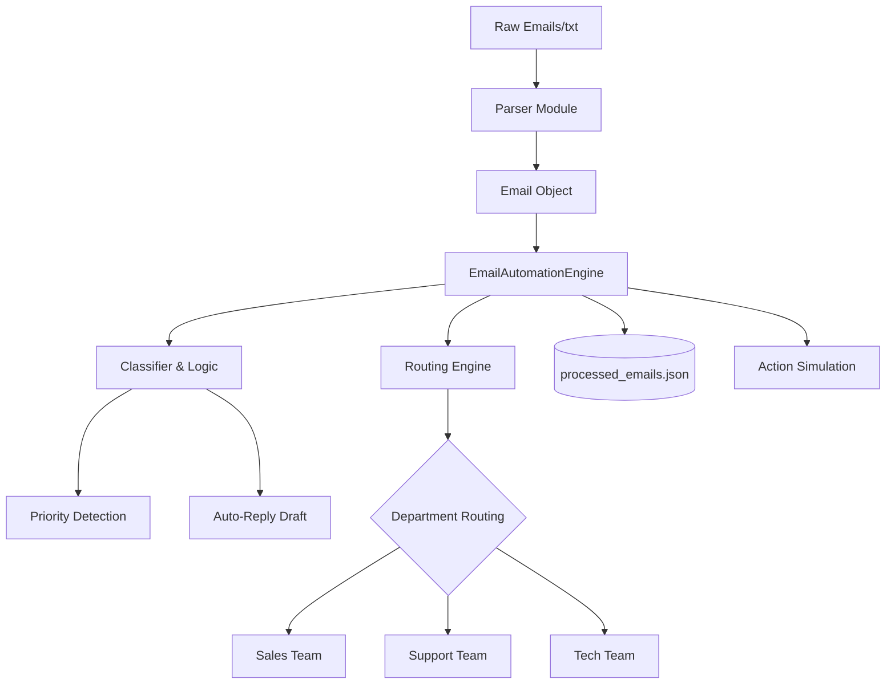

# 🚀 AI-Powered Email Automation System (v2.0 Pro)
> **Project #2 | Portfolio Showcase | Advanced Backend Automation**

[](https://www.python.org/)
[](https://opensource.org/licenses/MIT)
[](https://github.com/)
[](https://render.com/deploy?repo=https://github.com/KlarenceNevado/ai-email-automation)

An industrial-grade email triage engine designed to automate the parsing, classification, and routing of incoming communications. Version 2.0 introduces the **Pro-Grade Engine**, a class-based architecture that adds intelligent priority detection, automated response drafting, and professional system observability.

---

## 🏗️ Engineering Highlights (v2.0)
This system demonstrates production-ready software patterns:
- **Class-Based Engine**: Encapsulated pipeline logic within `EmailAutomationEngine` for scalability.
- **Priority Detection**: Analyzes urgency (High/Medium/Low) based on context-aware keywords.
- **Auto-Reply Engine**: Generates professional, department-specific draft responses.
- **Production Observability**: Full integration with the Python `logging` module for audit-ready execution logs.
- **Data Persistence**: Enriched JSON output with timestamps, unique IDs, and triage metadata.

---

## 📌 Problem Statement
Customer support and sales teams are often overwhelmed by unorganized email queues, leading to slow response times and missed opportunities.
**The Solution:** This engine automates the "Triage" phase—parsing raw data, identifying intent, scoring urgency, and routing it to the correct department with a draft response ready for human review.

---

## ✨ Key Features
- **Automated Ingestion**: Robust parsing with built-in error handling.
- **Intelligent Priority Scoring**: FAST-TRACKS urgent requests (Emergencies, Critical Errors).
- **Auto-Reply Drafting**: Provides immediate, context-specific response templates.
- **System Logging**: Tracks every stage of the pipeline with standardized timestamps.
- **Simulated Action Layer**: Mimics real-world system integrations.

---

## 🔄 Automation Workflow
This project follows a job-level automation pipeline:
1. **Email Ingestion**: Pulls raw data from `emails.txt`.
2. **AI Classification**: Identifies the intent (Complaint, Inquiry, etc.).
3. **Intelligent Routing**: Automatically assigns the email to the correct department (Sales, Tech, Support).
4. **Data Persistence**: Saves all enriched data to `processed_emails.json`.
5. **System Execution**: Simulates final actions like sending auto-replies.

---

## 🛠️ Technical Stack
| Category | Technology | Purpose |
| :--- | :--- | :--- |
| **Language** | Python 3 | Core logic and pipeline execution |
| **Observability** | Logging Module | Standardized system logs |
| **Data Format** | JSON | Structured data storage and audit trails |
| **AI Layer** | Simulated/AI-Ready | Intent classification & Priority detection |

---

## 📐 Project Architecture


---

## 📂 Project Structure
```text
ai-email-automation/
├── data/               # Input data and enriched JSON outputs
├── src/                # Core logic
│   ├── main.py         # v2.0 Class-based Engine
│   ├── parser.py       # Robust data extraction
│   └── classifier.py   # Intent, Priority & Response Logic
├── .env                # Environment configuration
├── requirements.txt    # Dependency list
└── README.md           # Professional Documentation
```

---

## ⚡ Quick Start

### 1. Setup
```bash
git clone https://github.com/KlarenceNevado/ai-email-automation.git
cd ai-email-automation
pip install -r requirements.txt
```

### 2. Execution
Run the pro-grade engine:
```bash
python src/main.py
```

---

## 🤝 Author
Created by **Klarence Nevado**  
*Automation Engineer specializing in AI-driven workflows and Backend Systems.*
